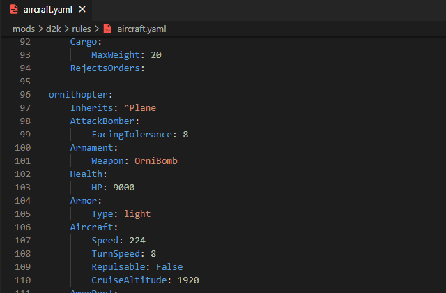
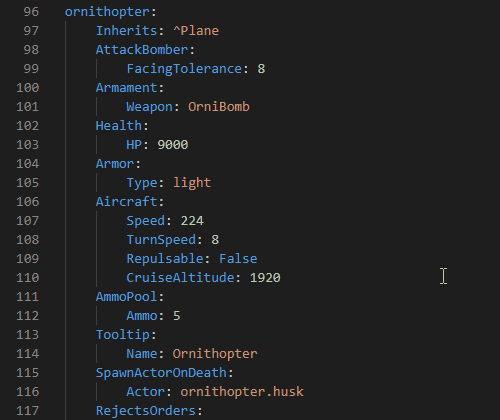
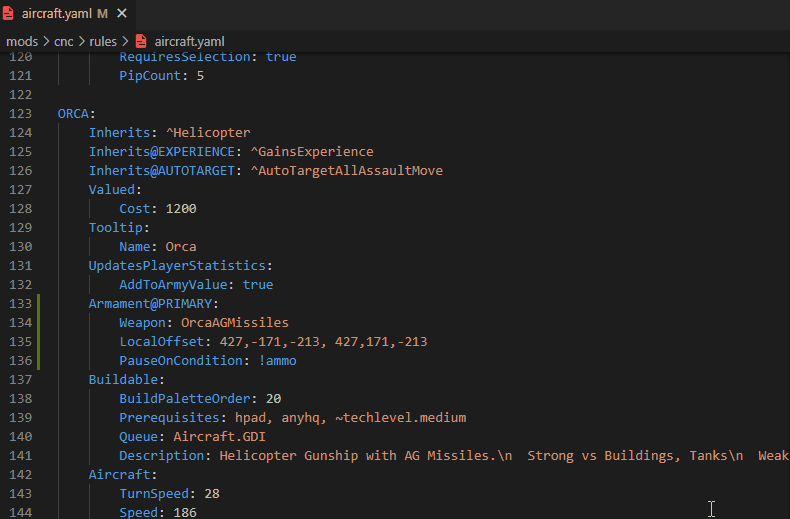
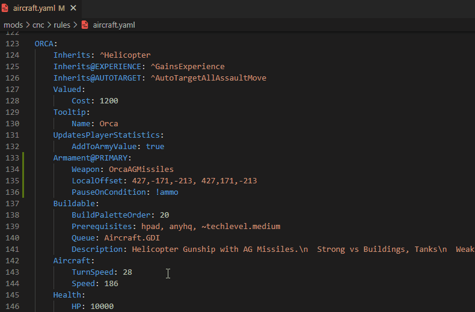

# Visual Studio Code extension for working with OpenRA's MiniYAML.

## Features

Current features include:
 - Hover info for Traits, Trait properties, actor and weapon definitions, conditions and more.
 - Navigating to Traits and Trait properties inside C# code (if available).
 - Navigating to actor and weapon definitions inside parsed MiniYAML files.
 - Context-aware IntelliSense to help with writing MiniYAML.

*See the bottom of the document for illustrations.

## Requirements

The language server requires .NET 6 to run.

## Extension Settings

This extension contributes the following settings:

 - `oraide.server.path`: Path to the language server.
 - `oraide.game.path`: A fallback OpenRA directory path.

## Release Notes

### 0.0.6

 - Improved extension README and added feature preview gifs.
 - Added extension icon.
 - Changed extension display name from "ORAIDE" to "OpenRA MiniYAML Language Extension (ORAIDE)"

### 0.0.4 and 0.0.5

 - Fixed extension being broken after custom "miniyaml" language removal. 

### 0.0.3

 - Started beautifying hover tooltips by using Markdown and by fixing parsing of Desc attributes on traits and trait properties.
 - Added links to online trait documentation.
 - Fixed a couple of small issues with the extension.
 - **Removed custom "miniyaml" language handling to not mess with defaults. That broke some things!**

### 0.0.2

First public release.

### Known issues

 - TooltipInfoBase inheritance is ignored, so inheriting types won't know about their `Name` property.
 - Currently only parsing code symbols from C# files is supported. Decompiling game binaries and reading trait information from a static file are not yet implemented.
 - The hover tooltip links to the online documentation may or may not work depending on your local version of OpenRA, as the links are never checked for validity and they always target the current release's documentation.

**Enjoy!**

## Feature previews:

 - Hovering over text in YAML files will (often) give helpful information:
    

        
    

 - Pressing Ctrl while hovering over text will activate VSCode's PeekDefinition:
    

        
    

 - Clicking on text will activate VSCode's GoToDefinition:
    - For actor definitions:
        

            
        

    - For weapon definitions:
        

            
        

    - For traits definitions:
        

            
        

    - And more...

 - There is even support for VSCode's IntelliSense:
        

            
        

        *(activated with Ctrl+Space or whatever your VSCode hotkeys are)*